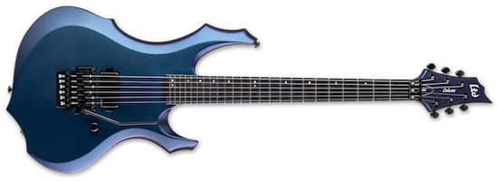
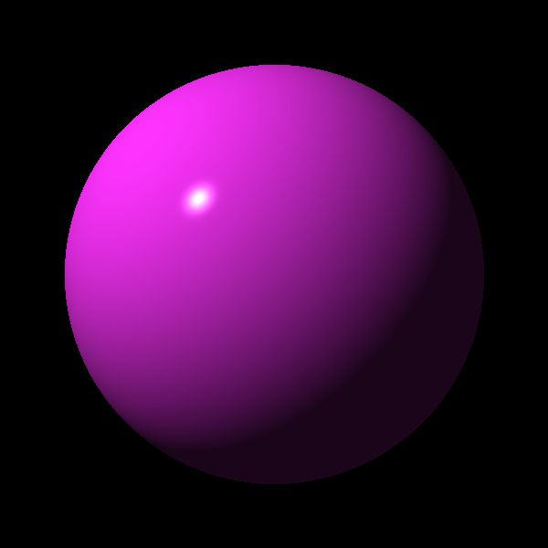

#  RayTracer
## Based on the Book [Ray Tracer Challenge by Jamis Buck](https://pragprog.com/book/jbtracer/the-ray-tracer-challenge)

For those who don't know about this book, it's a test-driven development approach to writing a ray tracer. Unlike most programming books, it tells you design principles and lays out what the tests should be like, but pseudocode rather than specifying a language. So language choice is personal, and I chose Swift.

Many of the various projects for Swift are largely UI based, but Swift is a general-purpose language, so I wanted to try a project that wasn't UI based to get a feel for using the language in a different way.

It's been a (ObiWan voice) *long time* since I've done significant geometry work. I've always had an interest in geometry ever since my mom got me [Cundy and Rollett's book *Mathematical Models*](https://en.wikipedia.org/wiki/Mathematical_Models_(Cundy_and_Rollett)) to placate me when I had an unfortunate math teacher, but I never went as far as I could have with it.

### Project Goals

1. Use Swift to its advantage. Small example: for dot producs, I defined the unary operator • rather than naming the function something with the word "dot." Similarly, for cross products, defined unary operator × rather than a named function.
2. Learn stuff! This isn't intended as a be-all, end-all ray tracer, but learning the principles of something I never happened to do before.
3. Render cool things! One of my thoughts about things I'd like to render after finishing the book, would be things like [this Haramis swirly volume knob](https://reverb.com/item/29250758-haramis-musical-hardware-strat-style-volume-knob-blue-swirl) or [this multichrome guitar](https://www.espguitars.com/products/27427-f-1001).

|  |  |
| --- | --- |

### One Motivation for Doing This

In 2020, I was sick with Covid (and long Covid) most of the year. During the active phase of the illness, I would sometimes see rooms change what [Platonic solid they were](https://en.wikipedia.org/wiki/Platonic_solid). While I was walking, typically. ([This is called Alice in Wonderland Syndrome](https://en.wikipedia.org/wiki/Alice_in_Wonderland_syndrome) and has been associated with both viruses and migraines, and guess what I had both of?)

Anyhow, I thought it would be interesting to be able to visually model it because it's hard for other people to envision what I experienced, especially when I talk about walls sliding away. That was a couple of weeks of some *very* disorienting spacial perceptions.

### Current Status

Just finished Chapter 8 (shadows).

About to start Chapter 9, Planes.

## Chapter 9, Planes

In this chapter, the first step is extracting what's common about shapes into a Shape class (though, as Buck notes, use the analogous concept in the language of choice.)

I'd already made Shape a protocol, which I think fits the bill; I called a generic non-abstract instance SampleShape. That'll be used for testing aspects of how the protocol works.

## Chapter 8, Shadows

Spheres with shadows, oh my!

## Chapter 7, Scenes

Let's put some spheres together, shall we? Note: these are all spheres, including the three walls.

## Chapter 6, Light and Shading

Your basic sphere with light and…less light. (Shadows are chapter 8.)

## Chapter 5, Ray-Sphere Intersections

This book was basically easy until Chapter 5, because the visualization of the concepts got ahead of me fairly early on. What I struggled with at first was why a sphere's intersection with a ray should be a float, not a point.

Then I realized that, while I'd been thinking about it from the sphere's POV, it's really where along the ray that point is, and you only need a floating point number to represent that (given that there's already a known direction and origin).

I read the intersection calculations several times, as well as some other implementations, and finally decided to just literally transcribe the book's description into Swift. Voila!

### Transformations and translations

> Want to translate your sphere away from the ray? That’s just the same as translating the ray away from the sphere, in the opposite direction […].

*sounds of brain matter splattering*

I'm so used to thinking of spatial things being (relatively) fixed that the idea of different things being in different spaces and perceptions suddenly, just to make calculation easier, is a real mindbender.

### Intersections, a set of

In reading, it seems that a lot of people have interpreted [Intersection] to be a property of the Intersection struct (or class), where I think it more properly should be attached to the ray. It's what the ray hit, right?

Also, I see no reason (at this point) not to make it a set, which can be filtered pretty easily. Though…that could break the tangent special case (where there is one hit on a sphere instead of two). For that reason, I'm going to make it an array.

So, for the tests relating to multiple intersections, I'm going to add a ray where there wasn't already one.

I'd previously called the t-value of Intersection distance, so I'm keeping that.

## Notes and ToDo

1. Rotated clock example from chapter 4 is rotated and upside-down, which I'd never have noticed if I hadn't used different colors for each hour marker. :P

## Other Implementations

It was cool to have a question about a detail I wasn't certain about and see implementations in so many other languages. Here are a few:

* [Swift](https://github.com/haruhikoM/RayTracerChallenge)
* [Swift](https://github.com/sbehnke/SwiftlyRT)
* [Swift](https://github.com/stein-a/RayTracer/)
* [Python](https://github.com/thomasdelrue/ray-tracer-challenge-python/tree/ce9fc90c5419d432416c65f1e83b824ce0f95dcb)
* [C++](https://github.com/kongsgard/raytracer/tree/f4f958516c8f479234c1c877cad54871f3857d51)
* [Scala](https://github.com/jamesmcm/raytracer_challenge_scala)
* [Rust](https://github.com/arsenypoga/rust-raytracer/tree/08568d9cdfcae84324698f3fc61985d16a1ce126)

Each of us made some different design choices, which are also interesting.

E.g., I made Tuple a class with Point and Vector inheriting from it, but [@sbehnke made Tuple a struct](https://github.com/sbehnke/SwiftlyRT), with no separate Point or Vector, just Point and Vector funcs within the Tuple class.
